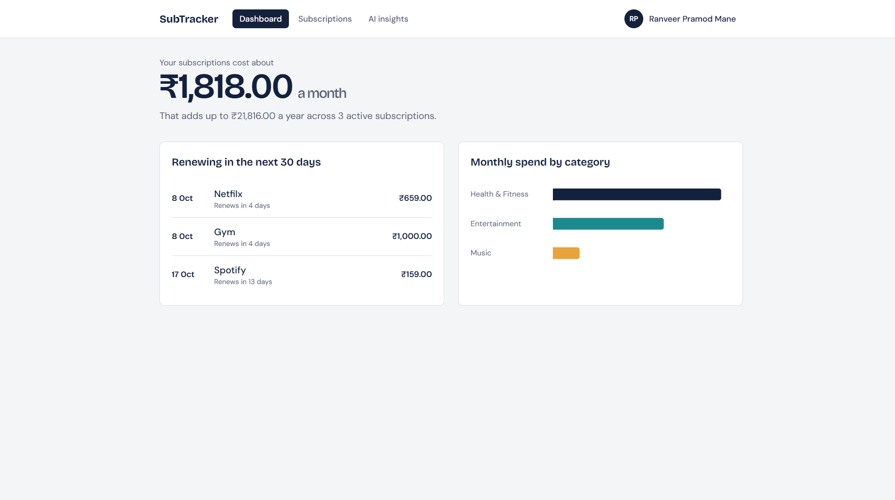
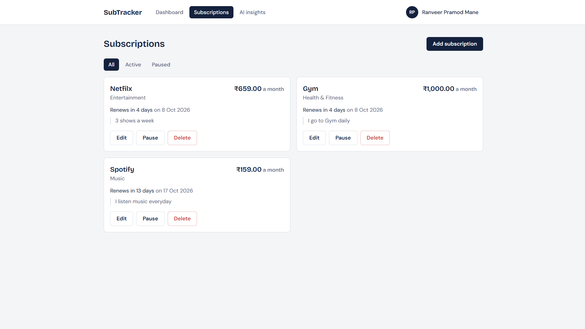
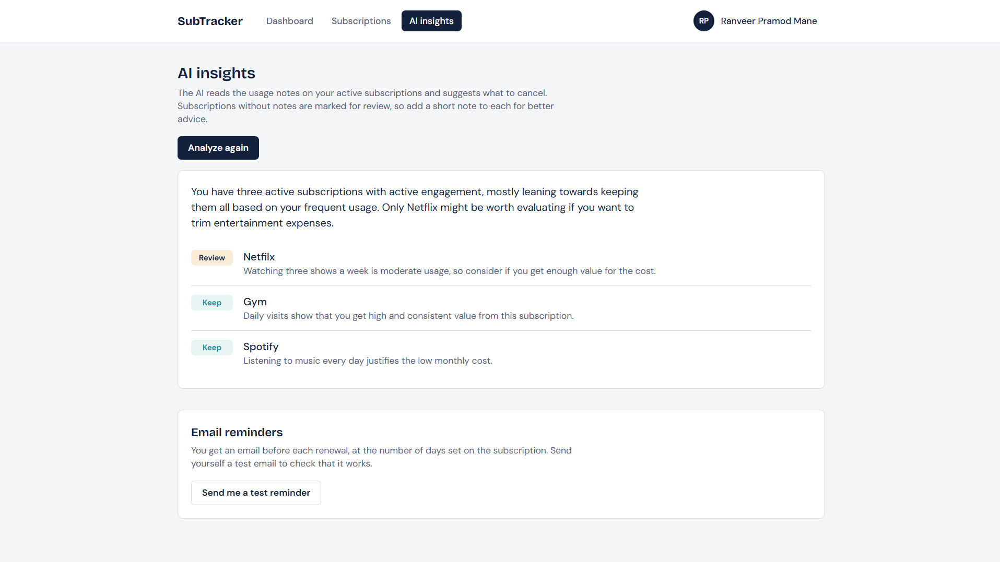
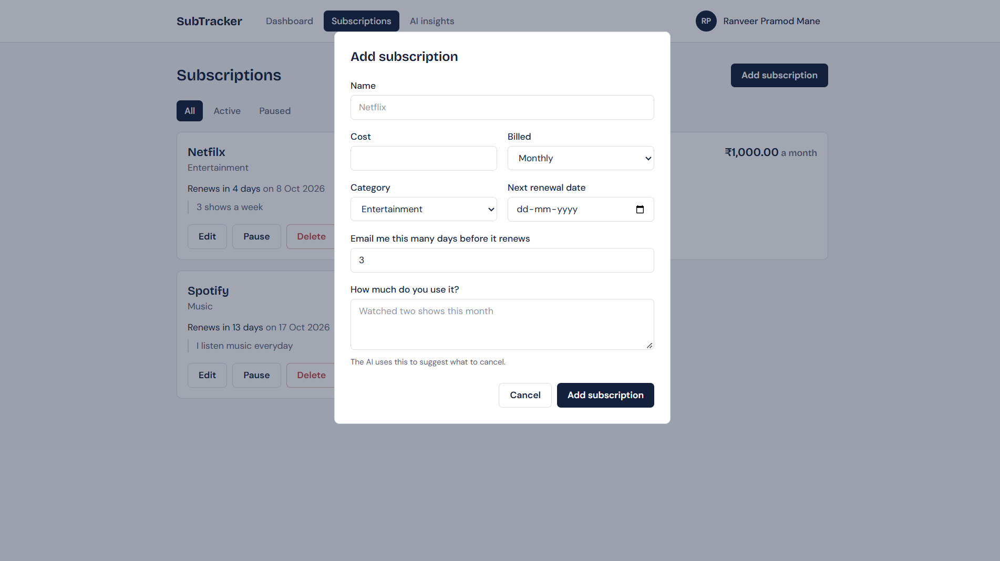
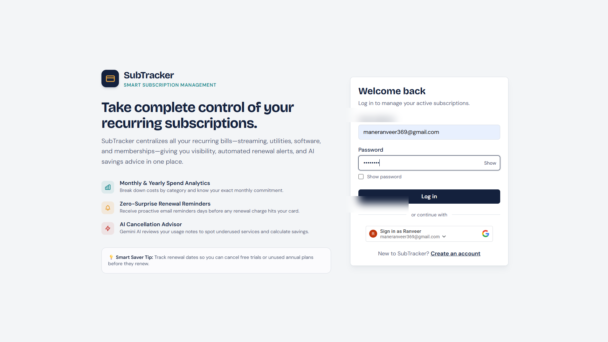
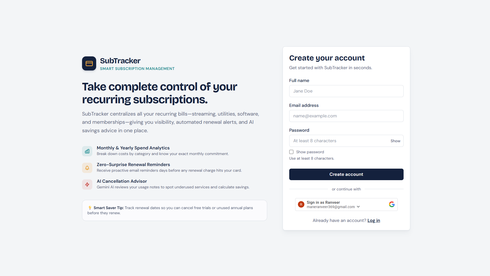

# 💳 Subscription Tracker

A full-stack app to track recurring subscriptions, manage renewal dates, analyze spending, get email reminders, and receive AI recommendations for subscriptions you may not be using.

[🚀 Live Demo](https://subscription-tracker-pink-eight.vercel.app) • [📦 GitHub](https://github.com/maneranveer111/subscription-tracker) • [💚 API Health](https://subscription-tracker-api-ut00.onrender.com/health)

---

## 📸 Screenshots

**Dashboard** – monthly/yearly spending, upcoming renewals, and cost by category.



**Subscription Management** – create, edit, pause, and delete subscriptions.



**AI Insights** – Gemini reads your usage notes and suggests `Keep` / `Review`.



**Add Subscription** – billing cycle, category, renewal date, reminder window, and usage info.



**Authentication** – email/password and Google Sign-In.





> The login screenshot is sanitized; no personal account information is included.

---

## ✨ Features

**📊 Dashboard**
- Total monthly and yearly recurring costs
- Spend by category (Recharts)
- Renewals due in the next 30 days
- Monthly/annual cost conversion for easy comparison

**📝 Subscription Management**
- Full CRUD (create, read, update, delete)
- Activate / pause (paused ones are excluded from spending)
- Monthly and yearly billing cycles
- Overdue renewal dates roll forward to the next cycle, including month-end cases (e.g. Jan 31 → shorter months)
- Custom reminder window (days before renewal)
- Usage notes for AI analysis

**🤖 AI Recommendations (Google Gemini)**
- Looks at cost, category, frequency, and usage notes
- Gives `cancel`, `keep`, or `review` with a short explanation
- Savings are calculated on the server, not by the AI
- Retry/fallback on supported Gemini failures
- Per-user cooldown to avoid repeated API calls

**📧 Email Reminders**
- HTML emails via Nodemailer + Gmail SMTP with renewal date and cost
- Duplicate prevention using `lastReminderFor`
- Internal `node-cron` scheduler for always-on servers
- Secure webhook for sleeping cloud servers (e.g. cron-job.org)

**🔐 Authentication**
- Email/password registration and login (`bcryptjs` hashing)
- JWT auth with configurable expiry
- Google OAuth / Sign-In
- Protected routes and profile management

---

## 💡 Engineering Highlights

- **Backend:** Express 5 REST API, split into routes / controllers / services / models / middleware / utils, Zod validation, centralized async error handling, Mongoose models, environment-based config
- **AI:** server-side Gemini calls, structured output, server-side money math, retry/fallback, per-user cooldown, usage notes treated as untrusted input (prompt-injection aware)
- **Automation:** background reminders, renewal roll-forward, duplicate prevention, internal cron + secure external webhook
- **Deployment:** React on Vercel, Express on Render, MongoDB Atlas, external cron, env-based production config

---

## 🛠️ Tech Stack

| Layer | Technology |
|---|---|
| Frontend | React 19, Vite 8, Tailwind CSS v4, React Router v7, Recharts, Axios, `@react-oauth/google`, DM Sans, Bricolage Grotesque |
| Backend | Node.js, Express 5, Mongoose 9, Zod, JWT, bcryptjs, google-auth-library, CORS |
| Database | MongoDB Atlas |
| AI | Google Gemini API |
| Email | Nodemailer + Gmail SMTP |
| Scheduling | node-cron + external cron service |
| Deployment | Vercel (frontend) + Render (backend) |
| Version Control | Git + GitHub |

---

## 🏗️ Architecture

```text
                    HTTPS
                      │
                      ▼
         ┌─────────────────────────┐
         │   React + Vite Frontend │
         │         Vercel          │
         └────────────┬────────────┘
                      │ REST API
                      ▼
         ┌─────────────────────────┐
         │    Node + Express API   │
         │         Render          │
         └──────┬──────┬──────┬───┘
                │      │      │
        ┌───────┘      │      └────────┐
        ▼              ▼               ▼
 ┌─────────────┐ ┌────────────┐ ┌─────────────┐
 │ MongoDB     │ │ Gemini API │ │ Gmail SMTP  │
 │ Atlas       │ │            │ │             │
 └─────────────┘ └────────────┘ └─────────────┘
                       ▲
                       │
              ┌────────┴────────┐
              │ External Cron   │
              │ cron-job.org    │
              └─────────────────┘
```

Google OAuth is also used by the backend to verify Google sign-in tokens.

---

## 📁 Project Structure

```text
subscription-tracker/
├── backend/
│   ├── src/
│   │   ├── config/       # db.js, env.js
│   │   ├── controllers/  # ai, auth, cron, googleAuth, reminder, subscription, summary
│   │   ├── jobs/         # reminderJob.js
│   │   ├── middleware/   # authMiddleware, errorHandler, validate
│   │   ├── models/       # Subscription.js, User.js
│   │   ├── routes/       # ai, auth, cron, reminder, subscription, summary
│   │   ├── services/     # emailService, geminiService, reminderService
│   │   ├── utils/        # asyncHandler, costUtils, dateUtils
│   │   ├── validators/   # authSchemas, subscriptionSchemas
│   │   ├── app.js
│   │   └── server.js
│   ├── .env.example
│   └── package.json
│
├── frontend/
│   ├── public/
│   ├── src/              # api, components, context, pages, utils, App.jsx, index.css, main.jsx
│   ├── .env.example
│   ├── package.json
│   ├── vercel.json
│   └── vite.config.js
│
├── docs/screenshots/     # dashboard, subscriptions, insights, add-subscription, login, register
└── README.md
```

---

## 🚀 Getting Started

**Prerequisites**
- Node.js 18+ and npm 9+
- MongoDB (local or Atlas)
- Optional: Google OAuth Client ID, Gemini API key
- Optional (needed for email reminders): Gmail App Password

**1. Clone**

```bash
git clone https://github.com/maneranveer111/subscription-tracker.git
cd subscription-tracker
```

**2. Backend**

```bash
cd backend
npm install
cp .env.example .env
```

Set at least:

```env
MONGO_URI=your_mongodb_connection_string
JWT_SECRET=your_secure_jwt_secret
```

Run it (at `http://localhost:5000`):

```bash
npm run dev
```

Check it's working:

```bash
curl http://localhost:5000/health
# {"status": "ok"}
```

**3. Frontend** (in a new terminal)

```bash
cd frontend
npm install
cp .env.example .env
```

Set:

```env
VITE_API_URL=http://localhost:5000/api
```

Run it (at `http://localhost:5173`):

```bash
npm run dev
```

---

## ⚙️ Environment Variables

Create `.env` files in both `backend/` and `frontend/`.

### Backend

| Variable | Required | Default | Description |
|---|:---:|---|---|
| `NODE_ENV` | No | `development` | App environment |
| `PORT` | No | `5000` | Server port (cloud platforms may set it) |
| `MONGO_URI` | **Yes** | — | MongoDB connection string |
| `JWT_SECRET` | **Yes** | — | Secret for signing JWTs |
| `JWT_EXPIRES_IN` | No | `7d` | JWT expiry |
| `CLIENT_URL` | No | `http://localhost:5173` | Allowed CORS origins |
| `GEMINI_API_KEY` | No | — | Gemini API key |
| `GEMINI_MODEL` | No | Configured model | Gemini model identifier |
| `EMAIL_USER` | No | — | Gmail sender address |
| `EMAIL_PASS` | No | — | Gmail App Password |
| `GOOGLE_CLIENT_ID` | No | — | Google OAuth Web Client ID |
| `CURRENCY` | No | `INR` | Currency code |
| `TIMEZONE` | No | `Asia/Kolkata` | Reminder timezone |
| `REMINDER_CRON` | No | `0 9 * * *` | Internal reminder schedule |
| `CRON_SECRET` | No | — | Secret for the external cron webhook |

### Frontend

| Variable | Required | Default | Description |
|---|:---:|---|---|
| `VITE_API_URL` | **Yes** | `http://localhost:5000/api` | Backend API base URL |
| `VITE_CURRENCY` | No | `INR` | Currency display code |
| `VITE_GOOGLE_CLIENT_ID` | No | — | Google OAuth Client ID |

> **Security:** Never commit `.env` files, JWT secrets, API keys, Gmail App Passwords, or cron secrets.

---

## 📡 API Reference

Protected endpoints need this header:

```http
Authorization: Bearer <your_jwt_token>
```

| Method | Endpoint | Access | Description |
|---|---|:---:|---|
| `POST` | `/api/auth/register` | Public | Register a new account |
| `POST` | `/api/auth/login` | Public | Log in with email/password |
| `POST` | `/api/auth/google` | Public | Log in with a Google credential |
| `GET` | `/api/auth/me` | Protected | Get your profile |
| `PUT` | `/api/auth/profile` | Protected | Update your profile |
| `GET` | `/api/subscriptions` | Protected | List your subscriptions |
| `POST` | `/api/subscriptions` | Protected | Create a subscription |
| `PUT` | `/api/subscriptions/:id` | Protected | Update a subscription |
| `DELETE` | `/api/subscriptions/:id` | Protected | Delete a subscription |
| `GET` | `/api/summary` | Protected | Financial metrics, category totals, upcoming renewals |
| `POST` | `/api/ai/cancel-suggestions` | Protected | Generate AI recommendations |
| `POST` | `/api/reminders/run` | Protected | Trigger a reminder test for the logged-in user |
| `POST` | `/api/internal/reminders` | Secret header | Run scheduled reminder processing |

The internal cron endpoint requires:

```http
X-Cron-Secret: <CRON_SECRET>
```

**Example subscription body:**

```json
{
  "name": "Spotify Premium",
  "cost": 119,
  "cycle": "monthly",
  "category": "Music",
  "nextRenewalDate": "2026-11-15T00:00:00.000Z",
  "reminderDaysBefore": 3,
  "usageNotes": "Listen daily during workouts and commutes",
  "isActive": true
}
```

---

## 🧠 How the AI Works

The server keeps all money calculations to itself and uses Gemini only for reasoning about usage.

```text
Subscriptions (usage notes + cost + cycle + category)
        ↓
Server-side validation
        ↓
Gemini analysis → cancel / keep / review
        ↓
Server-side savings calculation
        ↓
Structured recommendations
```

- Usage notes are treated as untrusted input
- Output is parsed and validated
- Retry/fallback handles supported API failures
- A per-user cooldown reduces repeated requests and quota usage

---

## ⏰ Email Reminders

There are two ways to run reminders.

**Option A – Internal `node-cron`** (always-on servers)

Runs `processReminders()` on the schedule `0 9 * * *` in `Asia/Kolkata`. It finds due subscriptions, checks the reminder window, skips duplicates, and sends the email.

**Option B – External cron webhook** (sleeping/free-tier servers)

An external service calls the webhook, which runs the same `processReminders()` flow:

```bash
curl -X POST https://your-backend.onrender.com/api/internal/reminders \
  -H "X-Cron-Secret: your_random_secret"
```

The endpoint uses a shared secret with constant-time comparison.

---

## ☁️ Deployment

| Component | Platform |
|---|---|
| Frontend | Vercel |
| Backend | Render |
| Database | MongoDB Atlas |
| AI | Google Gemini API |
| Email | Gmail SMTP |
| Scheduled reminders | External cron service |

**Frontend (Vercel):** set root directory to `frontend` and add:

```env
VITE_API_URL=https://your-backend-url/api
VITE_CURRENCY=INR
VITE_GOOGLE_CLIENT_ID=your_google_client_id
```

**Backend (Render):**

```text
Root Directory: backend
Build Command: npm install
Start Command: npm start
```

Add the production environment variables listed above.

**Google OAuth:** add your deployed frontend to the authorized JavaScript origins, and keep the local one if needed:

```text
https://your-app.vercel.app
http://localhost:5173
```

---

## 🧪 Testing

These flows were tested manually: registration, email/password login, Google auth, protected routes, subscription CRUD, dashboard and renewal calculations, AI recommendations, reminder triggering and automation, frontend/backend communication in production, API health checks, and environment configuration.

```bash
curl https://subscription-tracker-api-ut00.onrender.com/health
# {"status": "ok"}
```

> Automated unit and integration tests are planned.

---

## 🔐 Security

- Password hashing with `bcryptjs`
- JWT authentication and protected routes
- Google OAuth token verification
- Zod input validation and CORS configuration
- Secrets kept in environment variables
- Secret-protected cron endpoint with constant-time comparison
- Server-side financial calculations
- AI request cooldown
- Centralized error handling

Never expose `MONGO_URI`, `JWT_SECRET`, `GEMINI_API_KEY`, `EMAIL_PASS`, `CRON_SECRET`, or the Google OAuth Client Secret. Only the Google OAuth **Client ID** belongs in the frontend.

---

## 🔮 Future Improvements

- Automated unit and integration tests
- GitHub Actions CI/CD
- Docker containerization
- Redis caching and rate limiting
- More detailed spending trends
- Push/browser notifications
- Subscription sharing for families/teams
- More advanced AI usage analysis
- Better logging and observability
- Production monitoring and alerting
- Dedicated background job infrastructure

---

## 📌 Why This Project

Built to practice and show: full-stack development, REST API design, authentication and authorization, MongoDB data modeling, input validation, third-party API integration, AI app development, background jobs, email automation, cloud deployment, and production debugging.

---

## 📄 License

Open-source under the [ISC License](LICENSE).

<p align="center">Built with ❤️ using React, Node.js, MongoDB, and Gemini AI.</p>